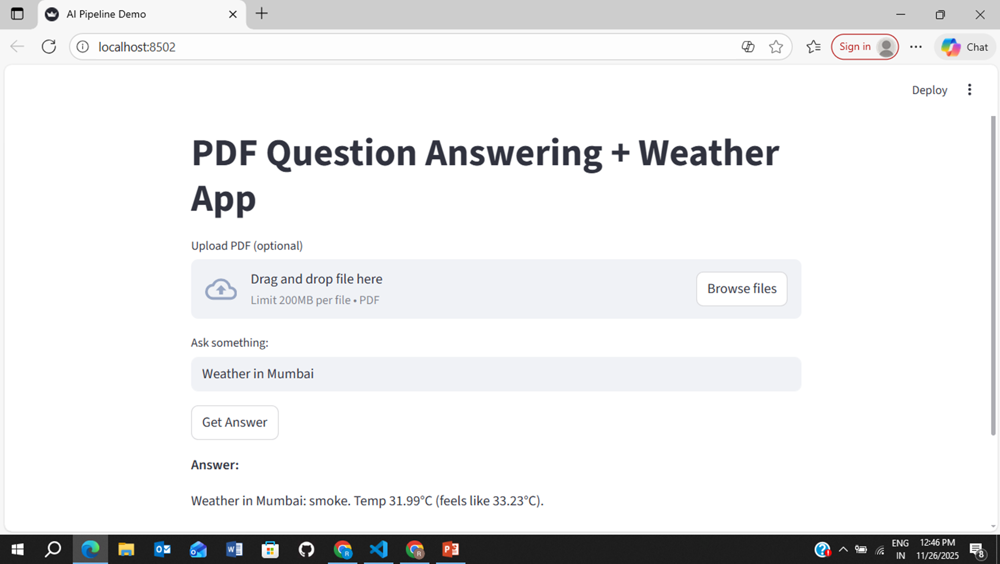

# Weather-Application-Using-GEN-AI

# Weather APP 

- Decision node (weather vs PDF RAG)
- Weather via OpenWeatherMap
- PDF extraction & chunking
- Embeddings with sentence-transformers
- Vector store integration with local Qdrant
- LLM wrapper (llama-cpp and Ollama)
- RAG retrieval via LangChain
- LangGraph builder
- Streamlit UI
- Tests (pytest)

Clone the Repository
git clone https://github.com/rutik1093

Create and Activate a Virtual Environment
python -m venv venv

Install Dependencies
pip install -r requirements.txt

Run Streamlit UI:
   streamlit run streamlit_app.py

Example Queries
Weather:

"What is the weather in Pune?

