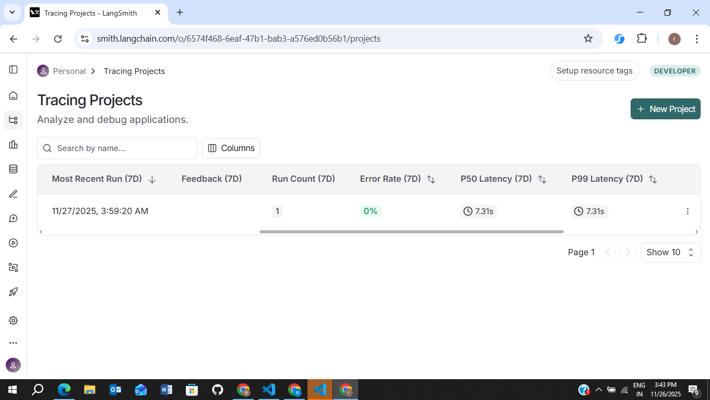
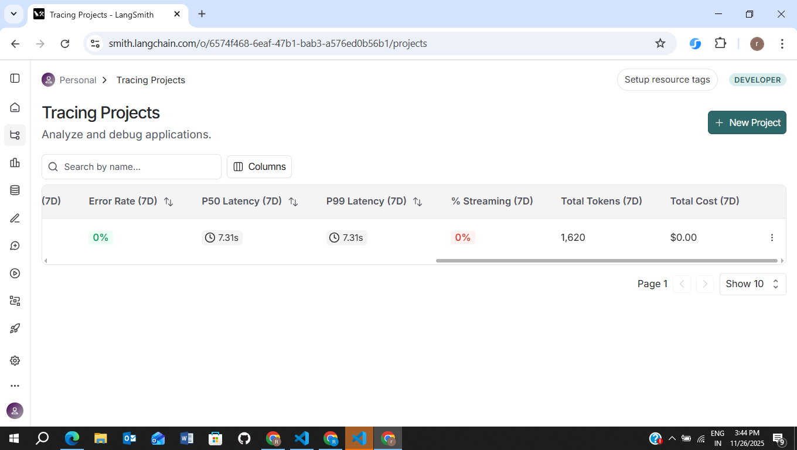

# Weather APP 

- Langsmith for evaluation of llm
- Decision node (weather vs PDF RAG)
- Weather via OpenWeatherMap
- PDF extraction & chunking
- Embeddings with sentence-transformers
- Vector store integration with local Qdrant
- LLM wrapper (llama-cpp and Ollama)
- RAG retrieval via LangChain
- LangGraph builder
- Streamlit UI
- Tests (pytest)

Clone the Repository
git clone https://github.com/rutik1093

Create and Activate a Virtual Environment
python -m venv venv

Install Dependencies
pip install -r requirements.txt

Run Streamlit UI:
   streamlit run streamlit_app.py

Example Queries
Weather:

"What is the weather in Pune?

1. Most Recent Run (7D)
Shows the latest time when our project executed a workflow run-- This means your app executed one full run at that time — including weather call or PDF search.

2. Run Count (7D)

it shows How many times our workflow ran in the last 7 days.This means LangSmith captured exactly one user request.

3. Error Rate (7D)
Percentage of runs that failed due to:API errors, Missing files, Exceptions, Bugs in nodes But our every run executed successfully.

4. Latency Metrics 
How long your workflow took to execute.
-- P50 Latency: 7.31s  
   P99 Latency: 7.31s
   This means your workflow takes about 7 seconds per query.

5.Total Tokens (7D)
Total number of tokens processed by LLM calls (if used).
1,620 tokens
Weather node doesn’t use tokens; PDF node uses embedding model + LLM to format text.

